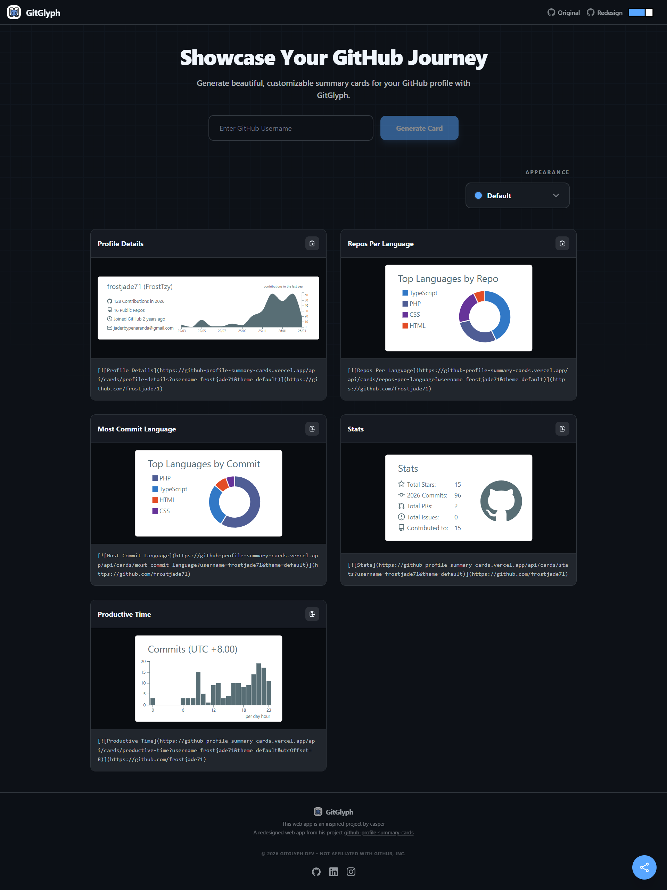

# 
# GitGlyph

A **GitHub Summary Card Generator** designed for developers to showcase their profiles with style. GitGlyph provides a seamless experience for generating statistics cards that you can easily share or embed in your profile.

## Features

### Card Generation
- **Instant Previews**: Enter your GitHub username and see your profile transformed into a sleek summary card.
- **Dynamic Themes**: Choose from a gallery of premium themes designed to match your aesthetic.

### Developer Focused
- **One-Click Export**: Easily copy your card's code or link to share it anywhere.
- **Zustand Powered**: Efficient state management for a snappy and responsive user interface.

### Modern Design
- **Tailwind 4 & Geist**: Utilizing the latest in styling and typography for a truly premium feel.
- **Glassmorphism**: Subtle effects and smooth transitions that make the UI feel alive.

### Global Accessibility
- **Responsive Layout**: Designed to look stunning on every device, from mobile to ultra-wide monitors.
- **Vercel Deployed**: Optimized for fast loading and global reach.

  

## Technology Stack

  

- **Frontend Core**: React 19, Vite 6, TypeScript
- **Styling**: Tailwind CSS 4
- **State Management**: Zustand
- **Icons & Typography**: Lucide React, Geist Variable Font
- **Deployment**: Optimized for Vercel

## License

This project is licensed under the [MIT License](LICENSE).

Copyright (c) 2026 Jaderby Peñaranda.
